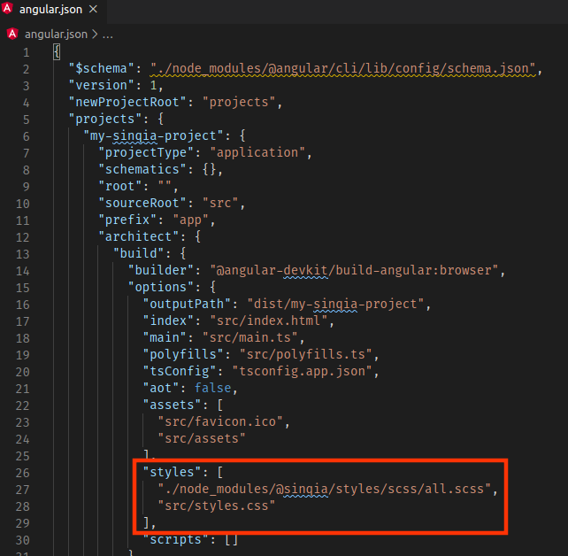

# alb-cli

Esse projeto tem como objetivo ser uma interface de linha de comando que permite instalar os pacotes necessários para que o lib Albert seja utilizado em seu projeto.

## Requisitos

É necessário que você possua o Node instalado em sua máquina.

É necessário que o projeto que você deseja instalar os pacotes seja um projeto Angular e que possua um arquivo `angular.json` na raíz do projeto.

## Instalação

Segue abaixo os processos necessários para instalar a albert-CLI.

### No Windows

No Windows, abra algum terminal de sua preferência como Administrador e execute o seguinte comando:

```shell
npm install -g https://nexus.sinqia.com.br/repository/npm-repo/@albert/cli/-/cli-1.0.0.tgz
```

### No Linux

No Linux, abra o terminale execute o mesmo comando com `sudo`:

```shell
sudo npm install -g https://nexus.sinqia.com.br/repository/npm-repo/@albert/cli/-/cli-1.0.0.tgz
```

## Uso

A albert-CLI possui somente o comando de instalação dos pacotes:

```shell
alb install
```

ou

```shell
alb i
```

Esse comando irá interagir com você para que você escolha os pacotes adicionais que deseja instalar. Ao final, o arquivo `angular.json` será atualizado com o estilo do pacote `@albert/styles` sendo priorizado na lista de estilos do projeto.

### Início da interação


### Instalando todos os pacotes


### Escolhendo pacotes


### Instalando somente o primeNG


### Angular.json atualizado



## Pacotes

Há dois tipos de pacotes que serão instalados com a utilização dessa CLI.

### Pacotes obrigatórios

Os pacotes obrigatórios são os pacotes que, independente do método de instalação, serão instalados. Segue abaixo a lista de pacotes obrigatórios:

  - [@albert/ui](https://nexus.albert.com.br/repository/npm-repo/@albert/ui)
  - [@albert/styles](https://nexus.albert.com.br/repository/npm-repo/@albert/styles)
  - [@angular/cdk](https://www.npmjs.com/package/@angular/cdk)
  - [date-fns](https://date-fns.org/)
  - [imask](https://imask.js.org/guide.html)

### Pacotes opcionais

Os pacotes opcionais são os pacotes que poderão ser escolhidos se serão instalados ou não. Segue abaixo a lista de pacotes opcionais:

  - [primeNG](https://primefaces.org/primeng/#/)
  - [ng-select](https://ng-select.github.io/ng-select#/data-sources)
